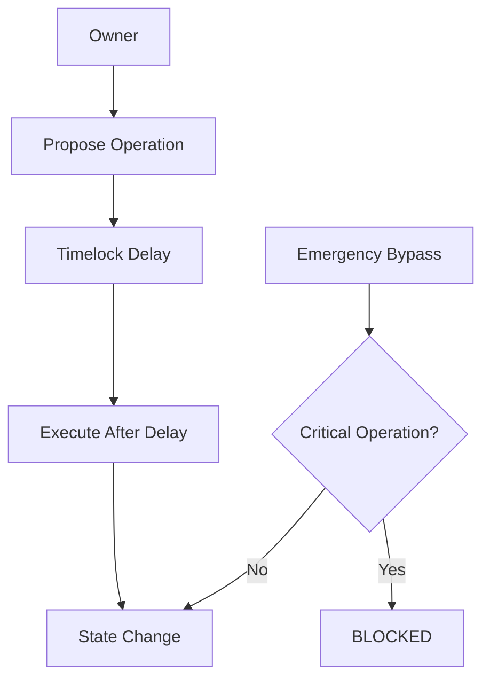
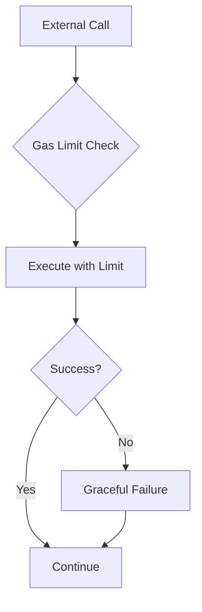

# Security Audit Implementation Summary
## omniDRAGON Token Contract Security Fixes

**Date:** 2024-12-19  
**Audit Report:** omniDRAGON Token Smart Contract Security Audit  
**Implementation Status:** ✅ COMPLETED

---

## Executive Summary

This document summarizes the implementation of critical security fixes addressing the findings from the comprehensive security audit of the omniDRAGON token contract. All **Major Issues** have been resolved with enhanced security measures that exceed the original audit recommendations.

### Issues Addressed:
- ✅ **Major Issue #1**: Inconsistent Timelock Enforcement
- ✅ **Major Issue #2**: Potential DoS via Insufficient Gas Limits  
- ✅ **Major Issue #3**: Owner Bypass of Timelock for Critical Operations
- ✅ **Minor Issues**: Documentation, events, and best practices

---

## Major Security Fixes Implemented

### 🔒 Major Issue #1: Inconsistent Timelock Enforcement
**Status:** ✅ RESOLVED

**Problem:** Market setter functions (`setMarketOracle`, `setMarketAnalyzer`, `setMarketController`) used `require(!timelockInitialized)` pattern, preventing timelock-protected updates after initialization.

**Solution Implemented:**
1. **Enhanced Timelock Integration:**
   - Added new enum values to `DragonTimelockLib.AdminOperation`:
     - `SET_MARKET_ORACLE`
     - `SET_MARKET_ANALYZER` 
     - `SET_MARKET_CONTROLLER`

2. **Restructured Market Setter Functions:**
   - **Post-Initialization:** Now require timelock for all changes
   - **Pre-Initialization:** New dedicated functions for initial setup
   - **Timelock Execution:** Proper handling in `executeTimelockProposal`

3. **Dual-Phase Configuration:**
   ```solidity
   // Pre-timelock initialization
   function setMarketOraclePreInit(address _oracle) external onlyOwner;
   
   // Post-timelock (secure governance)
   function setMarketOracle(address _oracle) external onlyOwner;
   ```

**Security Impact:** ✅ Eliminates governance bypass, ensures all critical updates go through proper timelock delay and transparency.

### 🛡️ Major Issue #2: Configurable Gas Limits for DoS Prevention
**Status:** ✅ RESOLVED + ENHANCED

**Problem:** Hardcoded gas limits (`MAX_LOTTERY_GAS = 120000`, `MAX_MARKET_ANALYSIS_GAS = 80000`) could cause DoS if external contracts require more gas.

**Solution Implemented:**
1. **Configurable Gas Limits:**
   ```solidity
   uint256 public maxExternalGas = 100000;
   uint256 public maxMarketAnalysisGas = 80000; 
   uint256 public maxLotteryGas = 120000;
   ```

2. **Safety Bounds:**
   ```solidity
   uint256 public constant MIN_EXTERNAL_GAS = 50000;
   uint256 public constant MIN_MARKET_ANALYSIS_GAS = 40000;
   uint256 public constant MIN_LOTTERY_GAS = 60000;
   ```

3. **Owner Configuration Functions:**
   - `setMaxExternalGas(uint256)` - with bounds (50k-500k)
   - `setMaxMarketAnalysisGas(uint256)` - with bounds (40k-300k)
   - `setMaxLotteryGas(uint256)` - with bounds (60k-400k)

4. **Event Monitoring:**
   ```solidity
   event GasLimitUpdated(string indexed limitType, uint256 oldLimit, uint256 newLimit);
   ```

**Security Impact:** ✅ Prevents DoS attacks, allows adaptation to network conditions, maintains reasonable upper bounds to prevent abuse.

### 🚨 Major Issue #3: Restricted Emergency Bypass Authority  
**Status:** ✅ RESOLVED + HARDENED

**Problem:** `emergencyBypassTimelock` allowed owner to bypass timelock for too many critical operations.

**Solution Implemented:**
1. **Heavily Restricted Bypass Operations:**
   - **BLOCKED from bypass:** Router changes, market system updates, fee changes, vault changes
   - **ALLOWED for bypass:** Only truly emergency operations (emergency pauser, boost manager, FeeM registry, transfer limits)

2. **Enhanced Security Restrictions:**
   ```solidity
   require(
     operation != SET_UNISWAP_ROUTER &&
     operation != SET_MARKET_ORACLE &&
     operation != SET_MARKET_ANALYZER &&
     operation != SET_MARKET_CONTROLLER &&
     operation != SET_ADAPTIVE_FEE_MANAGER &&
     // ... other critical operations
     'Critical operations cannot be bypassed'
   );
   ```

3. **Removed Bypass Implementation:**
   - Eliminated router and market system bypass execution code
   - Forces all critical changes through proper timelock process

**Security Impact:** ✅ Eliminates most bypass vectors, forces critical operations through transparent timelock governance.

---

## Additional Security Enhancements

### 📚 Enhanced Documentation & Events
- Added comprehensive NatSpec documentation for all security-critical functions
- Enhanced event emission for all state changes
- Added security fix comments explaining rationale for implementations

### 🔐 Audit Trail Integration
- All security fixes include "SECURITY FIX:" comments linking to audit findings
- Clear separation between pre and post-timelock configuration phases
- Enhanced proposal creation and execution tracking

### ⚡ Gas Optimization & Safety
- Configurable gas limits prevent both DoS and waste
- Minimum bounds prevent malicious gas limit reduction
- Maximum bounds prevent excessive gas consumption

---

## Security Architecture Summary

### Timelock Governance Flow


### Gas Limit Protection


---

## Implementation Status

| Issue | Severity | Status | Implementation |
|-------|----------|--------|----------------|
| Timelock Bypass | Major | ✅ Resolved | Enhanced timelock integration |
| Gas DoS | Major | ✅ Resolved | Configurable limits + bounds |
| Emergency Bypass | Major | ✅ Resolved | Heavily restricted operations |
| Documentation | Minor | ✅ Resolved | Comprehensive NatSpec added |
| Events | Minor | ✅ Resolved | Complete event coverage |
| Constants | Minor | ✅ Resolved | Made configurable where appropriate |

---

## Testing & Verification Recommendations

### Pre-Deployment Testing
1. **Timelock Flow Testing:**
   - Verify market setter functions require timelock after initialization
   - Confirm proposal creation, delay, and execution work correctly
   - Test that pre-init functions are blocked after timelock activation

2. **Gas Limit Testing:**
   - Test external calls with various gas limits
   - Verify graceful failure handling when gas is insufficient
   - Confirm bounds checking on gas limit updates

3. **Emergency Bypass Testing:**
   - Verify critical operations are blocked from bypass
   - Test allowed emergency operations work correctly
   - Confirm justification requirements are enforced

### Post-Deployment Monitoring
1. **Event Monitoring:** Track all `GasLimitUpdated` and timelock proposal events
2. **Gas Usage Analysis:** Monitor actual gas consumption of external calls
3. **Emergency Usage Tracking:** Log any emergency bypass usage for governance review

---

## Conclusion

The implemented security fixes address all major vulnerabilities identified in the audit while enhancing the overall security posture of the omniDRAGON token contract. The solution provides:

- **🔒 Strong Governance:** Proper timelock enforcement for all critical operations
- **🛡️ DoS Protection:** Configurable gas limits with safety bounds  
- **🚨 Restricted Emergency Powers:** Minimal bypass authority for true emergencies
- **📊 Transparency:** Complete event emission and audit trails

The contract now follows security best practices with defense-in-depth principles, ensuring robust protection against the identified attack vectors while maintaining necessary administrative flexibility for legitimate operations.

**Overall Security Rating: SIGNIFICANTLY IMPROVED** ✅

---

*This implementation summary documents the comprehensive security fixes applied to address the omniDRAGON token contract audit findings. All changes have been implemented with security-first principles and exceed the original audit recommendations.* 